# Social-Network-API

(Homework - 18: NoSQL: Social-Network-API)


<br>

[](https://opensource.org/licenses/MIT)
  

## Description:

Build an API for a social network web application where users can share their thoughts, react to friends’ thoughts, and create a friend list. You’ll use Express.js for routing, a MongoDB database, and the Mongoose ODM.

<br>

## User Story

```md
AS A social media startup
I WANT an API for my social network that uses a NoSQL database
SO THAT my website can handle large amounts of unstructured data
```

<br>

## Acceptance Criteria

```md
GIVEN a social network API
WHEN I enter the command to invoke the application
THEN my server is started and the Mongoose models are synced to the MongoDB database
WHEN I open API GET routes in Insomnia for users and thoughts
THEN the data for each of these routes is displayed in a formatted JSON
WHEN I test API POST, PUT, and DELETE routes in Insomnia
THEN I am able to successfully create, update, and delete users and thoughts in my database
WHEN I test API POST and DELETE routes in Insomnia
THEN I am able to successfully create and delete reactions to thoughts and add and remove friends to a user’s friend list
```
<br>

## Table of contents:

  * [License](#license)
  * [Video](#video)
  * [Installation](#installation)
  * [Usage](#usage)
  * [Contributions](#contributions)
  * [Tests](#tests)
  * [Credits](#credits)
  * [Author](#author)
  * [Questions](#questions)

<br>
  
## License:
<br>
      -  MIT License - Copyright (c) 2022 Jason Yoo

<br>
<br>

## Video:

(Part-One)

[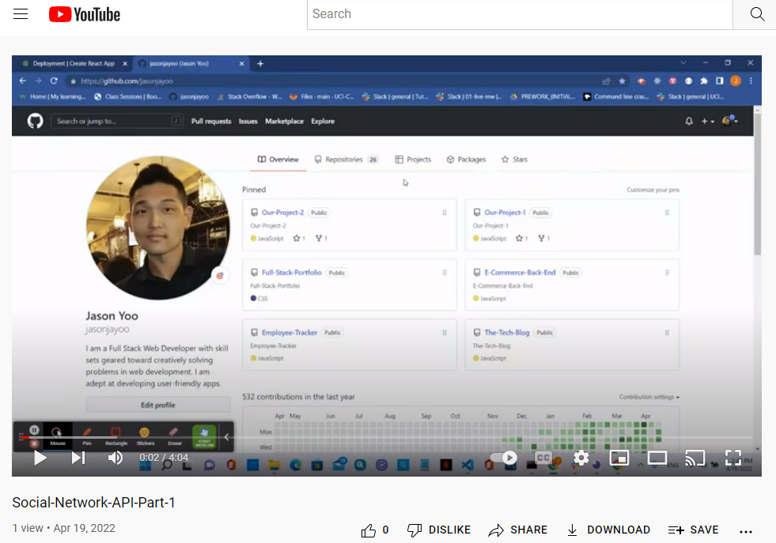](https://youtu.be/35Dn1T9RW0s) 

(Part-Two)

[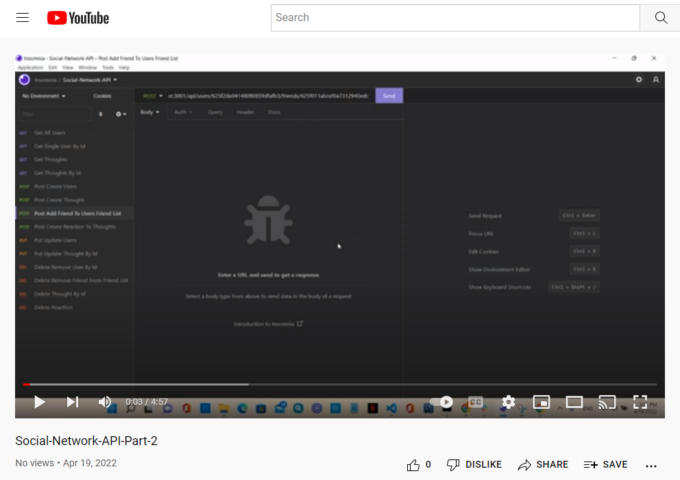](https://youtu.be/JQIym2oGUz4) 
  
  
<br> 
<br>

## Installation:
<br>
      -  Clone the files from my github repository provided below

<br>
<br>
  
## Usage: screenshots - (Highlighted Title(s) = a hyperlink to the direct image)

<br>

Once downloaded, open the file in VS Code.

<br>
  
[MongoDB Screenshot](images/Screenshotmongodb.png)  "MongoDB-Compass-Social-Network-API-DB"

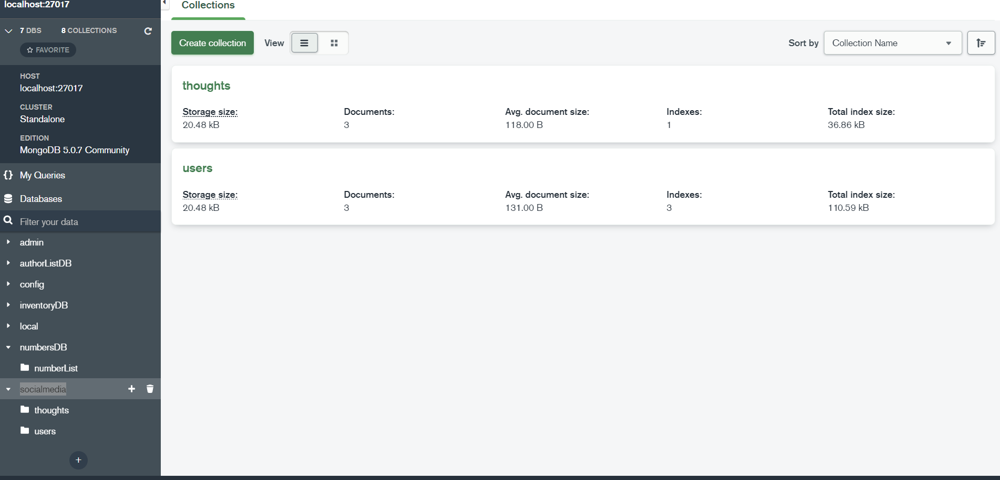

<br>

[Screenshot1](images/Screenshot1.png)  "Insomnia - Create User"

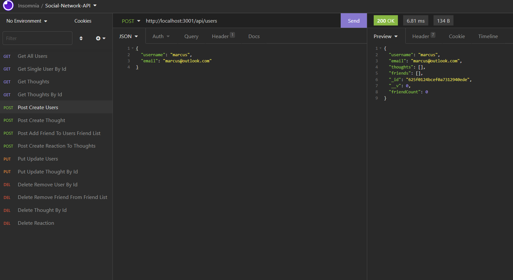

<br>

[Screenshot2](images/Screenshot2.png)  "Insomnia - Get All Users"

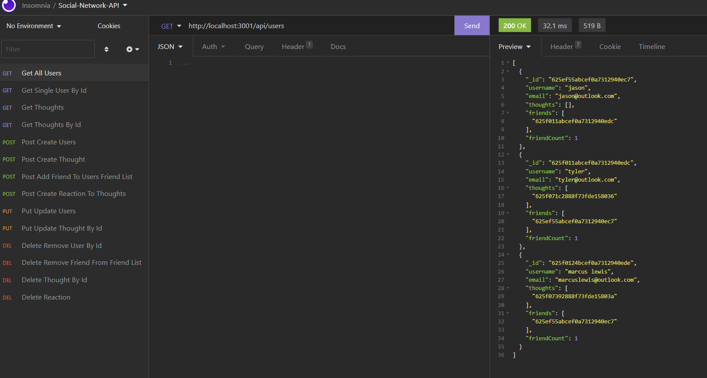

<br>

[Screenshot3](images/Screenshot3.png)  "Insomnia - Create Thought"
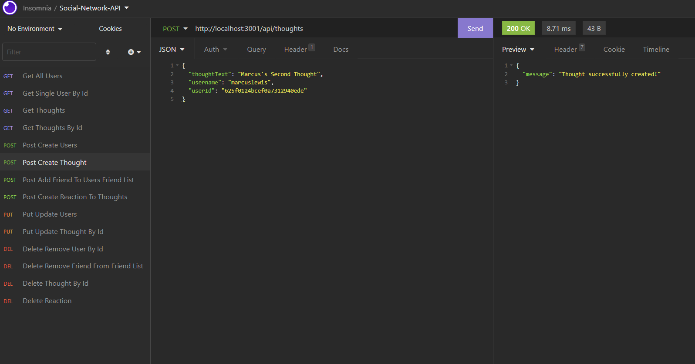

<br>

[Screenshot4](images/Screenshot4.png)  "Insomnia - Get Thoughts"
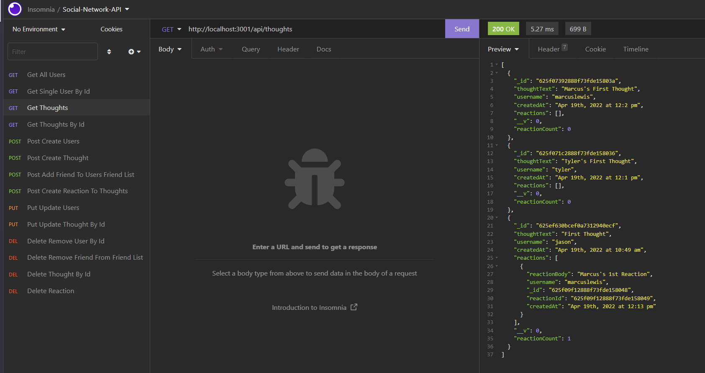

<br>

[Screenshot5](images/Screenshot5.png)  "Insomnia - Add Friend"
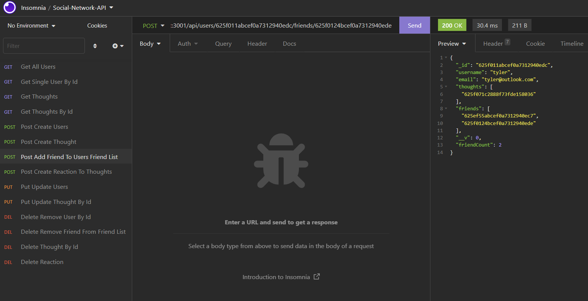

<br>

[Screenshot6](images/Screenshot6.png)  "Insomnia - Delete Friend"
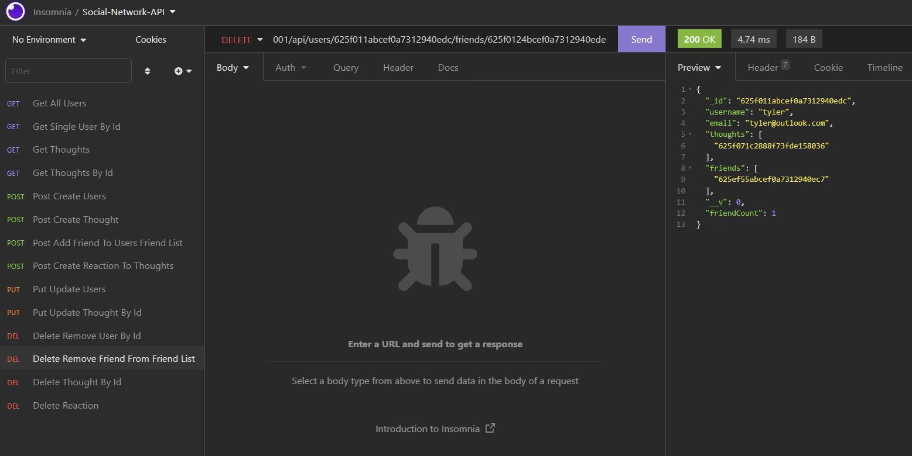

<br>

[Screenshot7](images/Screenshot7.png)  "Insomnia - Update Thought"
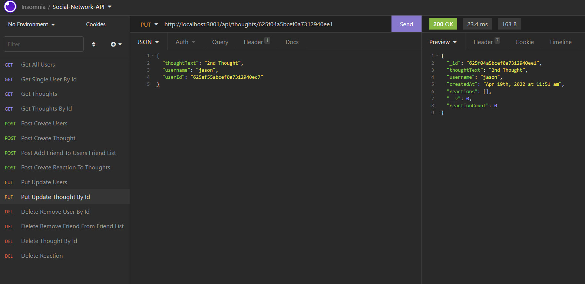

<br>

[Screenshot8](images/Screenshot8.png)  "Insomnia - Reaction to Thoughts"
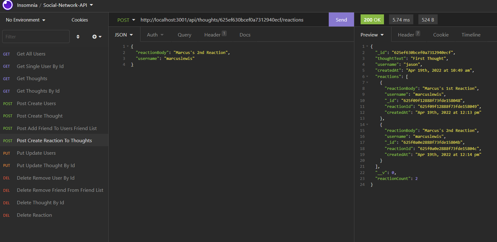

<br>

[Screenshot9](images/Screenshot9.png)  "Insomnia - Delete Reaction"
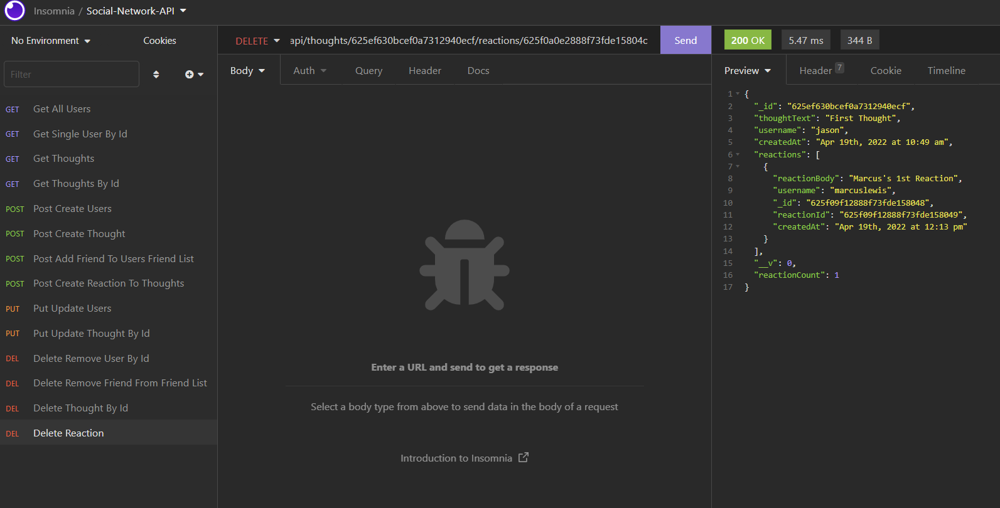

<br>
<br>

  
## Contributions:
<br>
Reach me at my email provided below to be added as a contributor.

<br>
<br>
  
## Tests: 
<br>
Do an npm install after cloning down the files, then do npm install express, and mongoose. Then in the terminal enter npm start. Open the application in Insomnia at local host 3001. 
  
<br>
<br>

## Credits:
<br>
I like to thank my amazing instructional staff for help me in this incredible journey of becoming a web developer.

I would also like to thank my esteemed cohort member Mr. Marcus Lewis for his insights and help in the development of this application.

<br>
<br>

## Author:
                               Jason Yoo
  

## Questions:
  For any questions regarding this application, you may reach me directly at jasonjayoo@outlook.com.

  To view my other applications, please check out my github page [jasonjayoo](https://github.com/jasonjayoo).

